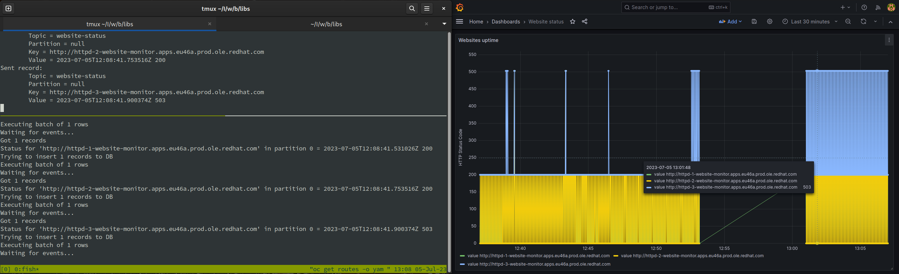

# Webmon

Testing out Kafka on OpenShift by making a website uptime tracker.

## Pre-requisites

### Create test websites
> This assumes you have a running OpenShift cluster and the `oc` command line tool installed.

Run `./scripts/setup-httpd.sh`

### Create 'website-status' topic
> This assumes you have [AMQ Streams](https://access.redhat.com/products/red-hat-amq/) or [Strimzi](https://developers.redhat.com/blog/2020/08/14/introduction-to-strimzi-apache-kafka-on-kubernetes-kubecon-europe-2020) running on your OpenShift cluster.

Run `oc create -f ./scripts/website-status-topic.yaml`

### Change Kafka config
Change config details in `src/main/resources/kafka_config_example.yaml` to match your environment and rename the file to `kafka_config.yaml`.

### Setup PostgreSQL database and Grafana

> Courtesy of [https://blog.devgenius.io/how-to-setup-grafana-with-postgresql-database-using-docker-compose-a-step-by-step-guide-e5a9cce90ba3](https://blog.devgenius.io/how-to-setup-grafana-with-postgresql-database-using-docker-compose-a-step-by-step-guide-e5a9cce90ba3)

> Default Grafana credentials: `admin:admin`

```bash
cd ./scripts/
sudo docker-compose up -d
```

## Build

Run the Gradle build task.

## Usage

### Start the producer

```bash
# Run this in the 'website-monitor' project
oc get routes -o yaml -o custom-columns=":spec.host" | xargs java -jar webmon-1.0-SNAPSHOT.jar produce
```

## Future considerations

- [ ] Figure out how to efficiently use more than one partition
- [ ] Make consumer code thread-safe
- [ ] Instead of each url thread sending a message to Kafka, maybe have them push messages to an array and send in batches
- [ ] Testing